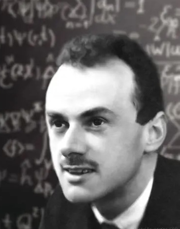
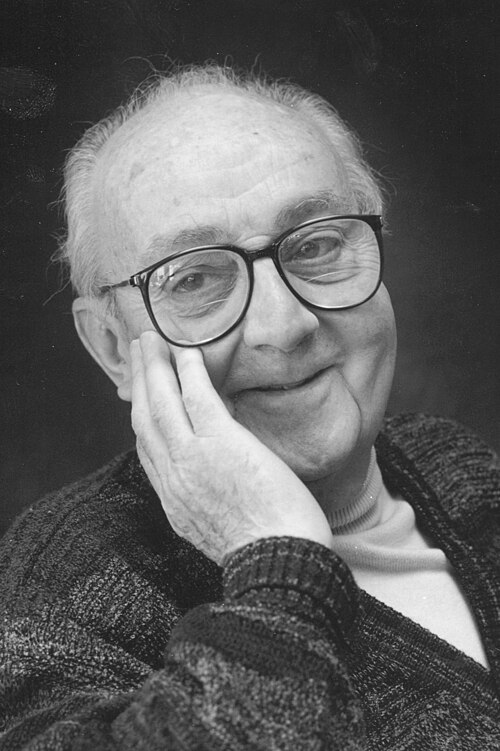
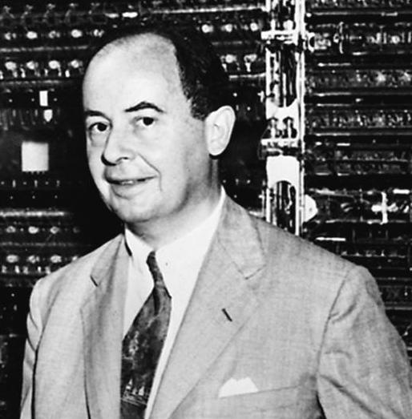
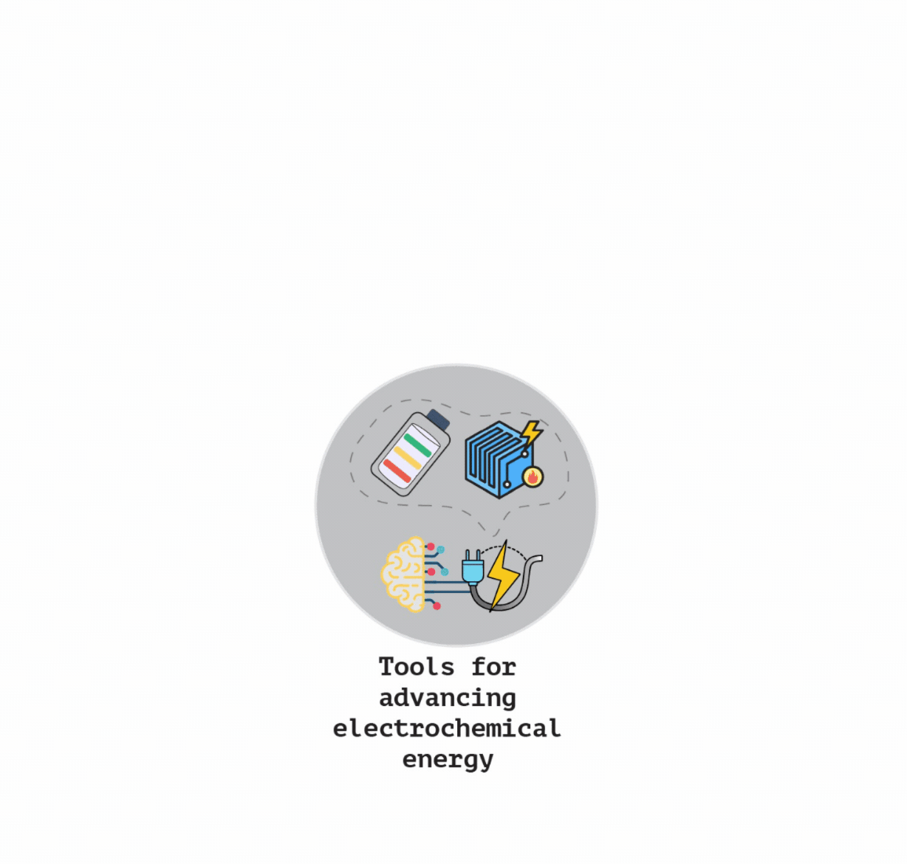

## About IE$^2$ Lab

  
   Modern electrochemical energy devices -- batteries, fuel cells, and electrolyzers -- are governed by phenomena spanning several orders of magnitude in length and time. Molecular interactions determine interfacial processes, interfacial processes influence transport and reaction kinetics, and these ultimately dictate device performance, lifetime, and safety. Despite decades of progress, connecting these scales into predictive and generalizable frameworks remains a major scientific challenge. Our vision is to bridge these scales through trustworthy AI, scientific theory, and multiscale simulations, enabling a new generation of predictive tools for electrochemical energy research.
 

### Challenge: breaking down silos
Electrochemical energy systems cannot be understood from a single perspective. Chemists design molecules and materials. Electrochemists study charge-transfer reactions and interfacial phenomena. Materials scientists investigate structure–property relationships. Engineers optimize device architectures and operating conditions. Yet the behavior of a battery or fuel cell emerges from the interaction of all these components simultaneously. A molecular design decision may alter interfacial chemistry, which affects transport processes, which ultimately influences device performance.

At IE$^2$ Lab, we seek to connect these traditionally separate domains through unified scientific and computational frameworks. Our goal is not merely to predict experimental outcomes, but to uncover the fundamental principles governing electrochemical systems.

### Our mission
Scientific discovery has historically advanced through a combination of theory, computation, and experiment. Artificial intelligence introduces a powerful new paradigm, but meaningful progress requires more than fitting data.

We believe that scientific AI should:

- Respect known physical laws and scientific principles
- Generate interpretable insights rather than black-box predictions
- Quantify uncertainty and establish trustworthiness
- Generalize across materials, chemistries, and operating conditions
- Enable the discovery of new scientific knowledge

Our research, therefore, focuses on developing AI systems that augment scientific reasoning rather than replace it.

Even though, we are working at the frontier of science to accelerate the transition to sustainable energy, we are still guided by following quotes by famous scientists:

  
  

    
"The fundamental laws necessary for the mathematical treatment of a large part of physics and the whole of chemistry are thus completely known, and the difficulty lies only in the fact that application of these laws leads to equations that are too complex to be solved."

    
— Paul A. M. Dirac

  

  
  

    
"All models are wrong, but some are useful."

    
— George E. P. Box

  

  
  

    
"With four parameters I can fit an elephant and with five I can make him wiggle his trunk."

    
— John von Neumann

  

---

## What do we do?

  
  
 
    <ul>
      <li><em>Data-driven materials discovery</em>: We develop interpretable and universal AI/ML models to identify promising and efficient electrolytes and electrodes for batteries, fuel cells, and other electrochemical energy technologies.</li>
      <li><em>Scientific theory development</em>: We refine existing scientific theories in the electrochemical energy field to make them more generalizable and universally applicable.</li>
      <li><em>Multiscale phenomena</em>: We develop tools and utilities to enable multiscale simulations to connect materials behavior at the atomistic scale to the device performance and macroscopic phenomena at the system level.</li>
      <li><em>Literature & data mining</em>: We automate extraction of insights from vast amounts of scientific data, accelerating the design of efficient materials for electrochemical energy devices.</li>
    </ul>
  

Please refer to the [Research](research) page for detailed research philosophy and research interests of our lab. Also, for more information about our team, please visit the [Members](members) page.

---

## Recent news & highlights
`
- [Samanvitha](members) joins as a Postdoc in the IE$^2$ Lab. She has joined our group after graduating from France and will be working on ML force field development for liquid electrolytes. | June 2026
- [Ritesh](members) contributed to a perspective article on AI agents for catalysis published in [Chem Catalysis](publications#pub-27). | June 2026
- [Sourabh](members) joins as the first member of the IE$^2$ Lab as Summer Intern through the TCG CREST's [ARC programme](https://tcgcrestdtbu.ac.in/rise/). | May 2026
- [Ritesh](members)'s perspective article on AI for batteries published in *[Current Opinion in Chemical Engineering](publications#pub-25)* as a part of Special Issue on "Artificial Intelligence and Chemical Engineering" | April 2026
- [Ritesh](members)'s co-authored work on electrolyte discovery using generative AI (`ElectrolyteGPT`) published in *[JACS Au](publications#pub-24)* (as a part of "Future Perspectives on Battery Chemistries" Special Issue) | April 2026
- [Ritesh](members) contributed to blog post by a [Chemistry World](https://www.chemistryworld.com/news/machine-learning-cuts-complexity-of-computational-calculations-in-catalysis/4023047.article) (published by Royal Society of Chemistry) | March 2026
- [Ritesh](members) named [2025 Rising Stars in Soft and Biologic Matter](https://mrsec.uchicago.edu/about-us/risingstars2025/), co-sponsored by University of Chicago and University of California San Diego | December 10, 2025
- [Ritesh](members)'s work on closed loop discovery of liquid electrolytes for anode-free lithium metal batteries has been published in *[Nature Communications](publications#pub-22)*. It was featured in EurekAlert! news release: [New AI model explores massive chemical space with minimal data](https://www.eurekalert.org/news-releases/1104049) | October 30, 2025
- [Ritesh](members) invited for talk at University of Oxford (ZERO Institute Seminar): [Accelerating liquid electrolyte discovery for next-generation batteries using data-driven techniques](https://zero.ox.ac.uk/events/zero-institute-seminar-accelerating-liquid-electrolyte-discovery-for-next-generation-batteries-using-data-driven-techniques-with-ritesh-kumar/) | September 18, 2025

Please refer to the [News & highlights](news) page for more news and highlights from the lab.

---

## Open positions (Summer 2026)

Thank you for your interest in our research. While we do not have any openings in the lab at this time, we encourage you to monitor future opportunities and reach out again.

~~We are actively seeking motivated postdocs, graduate students, and interns to join our team. We look for researchers eager to tackle complex challenges and contribute to high-impact work at the frontier of AI and electrochemical energy.~~

Interested candidates can refer to the [Openings](openings) page for more information.

---

## Collaboration opportunities

We welcome collaborations with researchers from academia and industry (national and international) on all aspects of electrochemical energy research -- computational, experimental, and scale-up.

If you are interested in collaborating with us, please feel free to reach out via email.

---

## How to contact us?

- **Email**: ritesh.kumar@tcgcrest.org

- **Affiliation**: School of Natural Sciences, Research Institute for Sustainable Energy (RISE), TCG CREST

- **Location**: First Floor, Bengal Intelligent Park, EP Block, Sector V, Salt lake, Kolkata - 700091, West Bengal, India 

---

## Explore

- [Members](members)
- [Research](research)
- [Publications](publications)
- [Software](software)
- [Teaching](teaching)
- [Funding & resources](funding)
- [Fun & recreation](fun)
- [News & highlights](news)
- [Openings](openings)
- [Blogs](blogs)
- [Research facilities](research_facilities)
