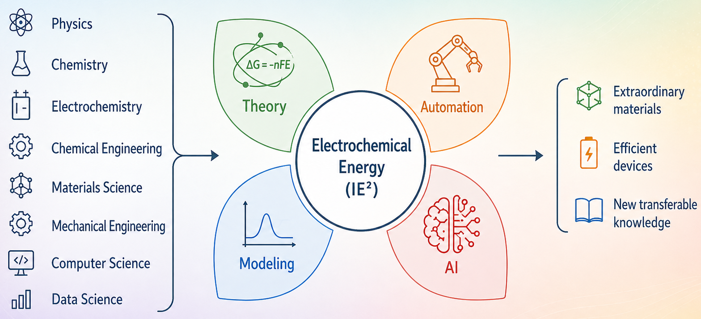
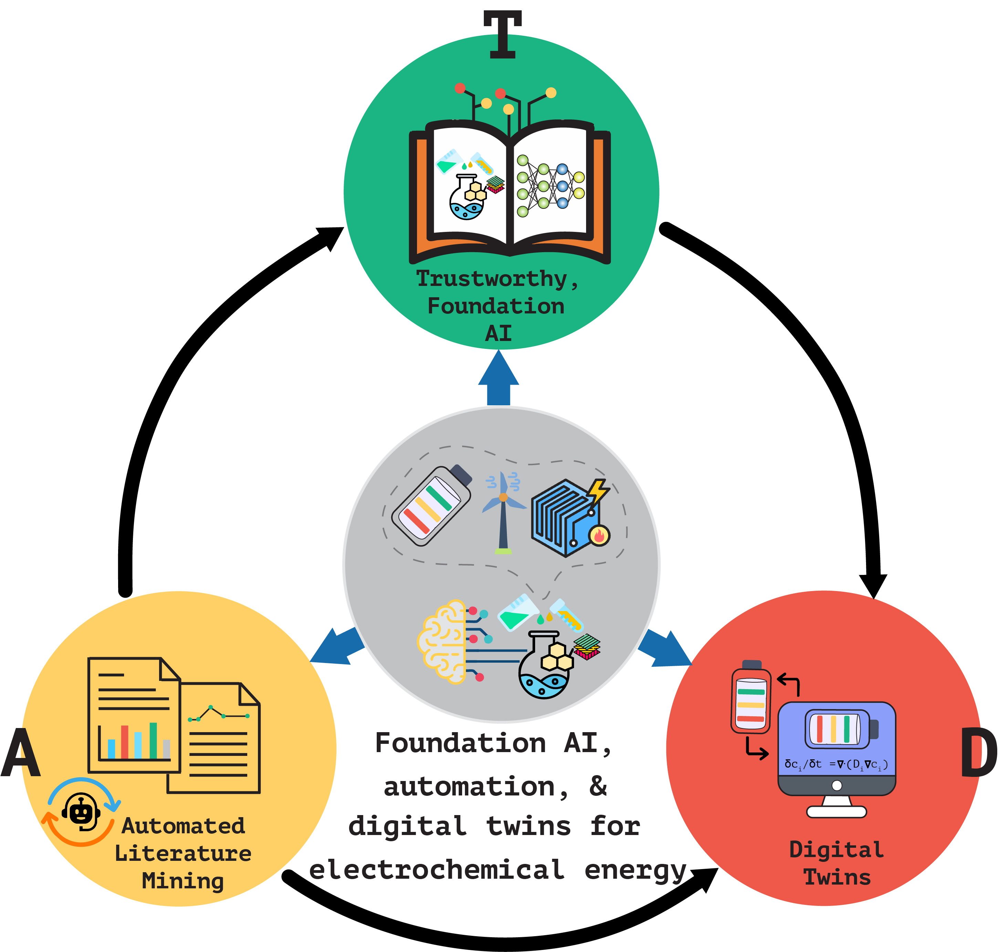

## About IE$^2$ Lab

  
   Our research focuses on accelerating the realization of next-generation electrochemical energy devices. We work at the intersection of artificial intelligence (AI), multiscale computer simulations, and scientific theory. By developing trustworthy AI and physics-informed models, we bridge the gap between microscopic molecular design and macroscopic device performance. Our goal is the rational development of high-performance batteries and energy conversion devices. 

### Challenge: breaking down silos
Currently, energy research is fragmented. Chemists and materials scientists focus on a "bottom-up" approach to designing molecules and materials. Electrochemists are interested inthe complex reactions and phenomena at the electrode-electrolyte interfaces. Engineers focus on scaling these discoveries into real-world devices.
The problem is that these groups often speak entirely different technical languages. This lack of communication means that vital knowledge is rarely integrated seamlessly. While data-driven tools (AI/ML) have the potential to unite these fields, "off-the-shelf" AI rarely provides the deep scientific insights needed for a breakthrough.

### Our mission
We strive to put the pieces of the puzzle together. Our lab develops unified, general-purpose, and trustworthy data-driven techniques specifically tailored for electrochemical energy. We are here to blur the lines between disciplines, much like James Clerk Maxwell did by connecting electricity and magnetism. In this group, we are chemists, physicists, materials scientists, and data scientists working as one.

For more details on our team, please visit the [Members](members) page.

---

## What do we do?

  
  
 
    <ul>
      <li><em>Data-driven materials discovery</em>: We develop interpretable and universal AI/ML models to identify promising and efficient electrolytes and electrodes for batteries, fuel cells, and other electrochemical energy technologies.</li>
      <li><em>Scientific theory development</em>: We refine existing scientific theories in the electrochemical energy field to make them more generalizable and universally applicable.</li>
      <li><em>Multiscale phenomena</em>: We develop tools and utilities to enable multiscale simulations to connect materials behavior at the atomistic scale to the device performance and macroscopic phenomena at the system level.</li>
      <li><em>Literature & data mining</em>: We automate extraction of insights from vast amounts of scientific data, accelerating the design of catalysts for industrial reactions.</li>
    </ul>
  

Please refer to the [Research](research) page for detailed research philosophy and research interests of our lab.

---

## Recent news & highlights

- [Ritesh](members)'s perspective paper on AI for batteries published in *Current Opinion in Chemical Engineering* as a part of Special Issue on "Artificial Intelligence and Chemical Engineering" | April 2026 → [Publication #25](publications#pub-25)
- [Ritesh](members)'s paper on electrolyte discovery paper using generative AI (`ElectrolyteGPT`) published in *JACS Au* (published as a part of "Future Perspectives on Battery Chemistries" Special Issue) | April 2026 → [Publication #24](publications#pub-24)
- [Ritesh](members) contributed to blog post by a [Chemistry World](https://www.chemistryworld.com/news/machine-learning-cuts-complexity-of-computational-calculations-in-catalysis/4023047.article) (published by Royal Society of Chemistry) | March 2026
- [Ritesh](members) named [2025 Rising Stars in Soft and Biologic Matter](https://mrsec.uchicago.edu/about-us/risingstars2025/), co-sponsored by University of Chicago and University of California San Diego | December 10, 2025
- EurekAlert! news release: [New AI model explores massive chemical space with minimal data](https://www.eurekalert.org/news-releases/1104049) | October 30, 2025
- [Ritesh](members) invited for talk at University of Oxford (ZERO Institute Seminar): [Accelerating liquid electrolyte discovery for next-generation batteries using data-driven techniques](https://zero.ox.ac.uk/events/zero-institute-seminar-accelerating-liquid-electrolyte-discovery-for-next-generation-batteries-using-data-driven-techniques-with-ritesh-kumar/) | September 18, 2025

Please refer to the [News & highlights](news) page for more news and highlights from the lab.

---

## Openings (April 2026)

We are actively seeking motivated postdocs, graduate students, and interns to join our team. We look for researchers eager to tackle complex challenges and contribute to high-impact work at the frontier of AI and electrochemical energy.

Interested candidates can refer to the [Openings](openings) page for more information.

---

## How to contact us?

- **Email**: ritesh.kumar@tcgcrest.org

- **Affiliation**: School of Natural Sciences, Research Institute for Sustainable Energy (RISE), TCG CREST

- **Location**: First Floor, Bengal Intelligent Park, EP Block, Sector V, Salt lake, Kolkata - 700091, West Bengal, India 

---

## Explore

- [Members](members)
- [Research](research)
- [Publications](publications)
- [Software](software)
- [Teaching](teaching)
- [Funding & resources](funding)
- [Fun & recreation](fun)
- [News & highlights](news)
- [Openings](openings)
- [Blogs](blogs)
- [Research facilities](research_facilities)
