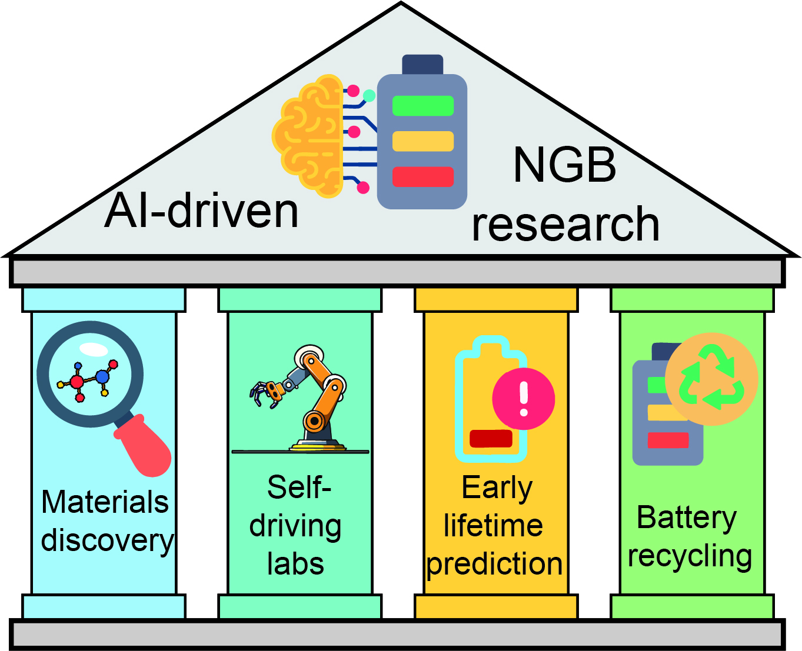
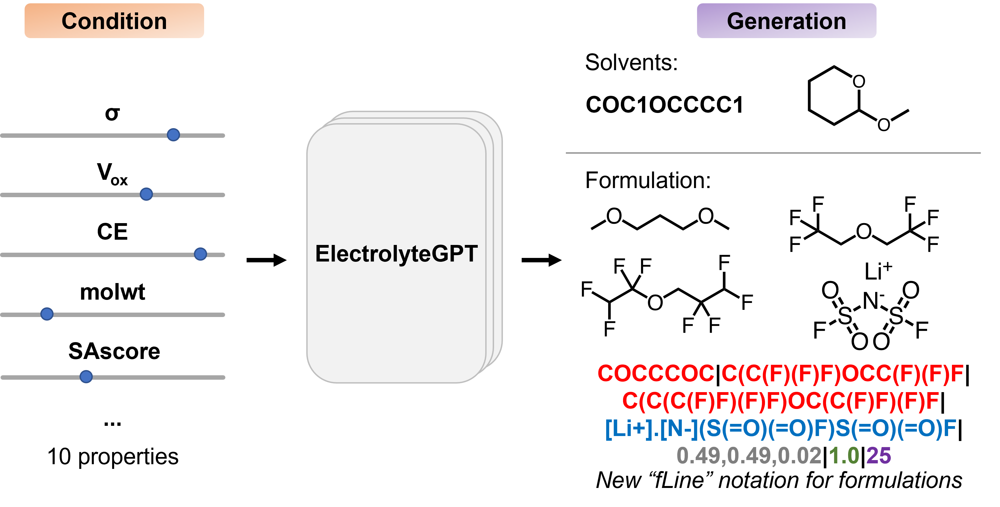

**Notes**: 
1. † denotes equal contribution
2. * denotes corresponding authorship

# IE$^2$ Lab publications

## Preprints

## Peer-reviewed articles

---

# Ritesh's postdoc/Ph.D. publications

## Preprints

1. M. Dey, **R. Kumar**, A. K. Singh. "Synergistic Interplay between Surface Polarons and Adsorbates for Photocatalytic
Nitrogen Reduction on TiO$_2$(110)." *arXiv* (2026) [DOI](https://doi.org/10.48550/arXiv.2604.09291)

---

## Peer-reviewed articles

### 2026

  
  25. <strong>R. Kumar</strong>, C. V. Amanchukwu. “AI-accelerated realization of next-generation batteries: <em>status quo</em> and outlook.” <em>Curr. Opin. Chem. Eng.</em> <strong>52</strong>, 101252 (2026). <a href="https://doi.org/10.1016/j.coche.2026.101252">DOI</a> (Part of <a href="https://www.sciencedirect.com/special-issue/10R5JHLL00S">“Artificial Intelligence and Chemical Engineering” Special Issue</a>) 

<!--  -->

  
  24. J. Kim, K.-H. Wang, <strong>R. Kumar</strong>, P. Ma, C. V. Amanchukwu. “Generative Electrolyte Solvent and Formulation Discovery.” <em>JACS Au</em> (2026). <a href="https://doi.org/10.1021/jacsau.5c01628">DOI</a> (Part of <a href="https://axial.acs.org/energy/call-for-papers-future-perspectives-on-battery-chemistries">“Future Perspectives on Battery Chemistries Special Issue”</a>) 

  
  23. <strong>R. Kumar†</strong>, K.-H. Wang†, C. V. Amanchukwu. “Using Electrolyte Solvent Embeddings to Guide Battery Electrolyte Discovery.” <em>Mol. Syst. Des. Eng.</em> (2026). <a href="https://doi.org/10.1039/D5ME00188A">DOI</a> (Part of <a href="https://pubs.rsc.org/en/journals/articlecollectionlanding?sercode=me&themeid=b6a6d88a-a1a0-4884-a892-f4760c1cf502">“Festschrift in honour of Juan de Pablo’s 60th birthday”</a> Themed Collection) <strong>Featured on the cover image</strong> 

### 2025

  
  22. P. Ma†, <strong>R. Kumar†</strong>, K.-H. Wang, C. V. Amanchukwu. “Active learning accelerates electrolyte solvent screening for anode-free lithium metal batteries.” <em>Nat. Commun.</em> <strong>16</strong>, 8396 (2025). <a href="https://doi.org/10.1038/s41467-025-56398-7">DOI</a>

  
  21. H. Fejzic, <strong>R. Kumar</strong>, R. J. Gomes, L. He, T. J. Houser, J. Kim, N. Molten, C. V. Amanchukwu. “Water Clustering Modulates Activity and Enables Hydrogenated Product Formation during Carbon Monoxide Electroreduction in Aprotic Media.” <em>J. Am. Chem. Soc.</em> <strong>147</strong>, 18445–18459 (2025). <a href="https://doi.org/10.1021/jacs.4c13374">DOI</a>

  
  20. <strong>R. Kumar</strong>, M. C. Vu, P. Ma, C. V. Amanchukwu. “Electrolytomics: A Unified Big Data Approach for Electrolyte Design and Discovery.” <em>Chem. Mater.</em> <strong>37</strong>, 2720–2734 (2025). <a href="https://doi.org/10.1021/acs.chemmater.4c03309">DOI</a>

### 2024

  
  19. R. J. Gomes, <strong>R. Kumar</strong>, H. Fejzic, B. Sarkar, I. Roy, C. V. Amanchukwu. “Modulating Water Hydrogen Bonding within a Nonaqueous Environment Controls its Reactivity in Electrochemical Transformations.” <em>Nat. Catal.</em> <strong>7</strong>, 689–701 (2024). <a href="https://doi.org/10.1038/s41929-024-01155-6">DOI</a>

  
  18. E. S. Doyle, P. Mirmira, P. Ma, M. C. Vu, T. Hixson-Wells, <strong>R. Kumar</strong>, C. V. Amanchukwu. “Phase Morphology Dependence of Ionic Conductivity and Oxidative Stability in Fluorinated Ether Solid-State Electrolytes.” <em>Chem. Mater.</em> <strong>36</strong>, 5063–5076 (2024). <a href="https://doi.org/10.1021/acs.chemmater.3c03291">DOI</a>

  
  17. P. Ma, <strong>R. Kumar</strong>, M. C. Vu, K.-H. Wang, P. Mirmira, C. V. Amanchuwku. “Fluorination promotes lithium salt dissolution in borate esters for lithium metal batteries.” <em>J. Mater. Chem. A</em> <strong>12</strong>, 2479–2490 (2024). <a href="https://doi.org/10.1039/D3TA06420K">DOI</a>

### 2022

  
  16. P. V. Sarma†, R. Nadarajan†, <strong>R. Kumar</strong>, R. M. Patinharayil, N. Biju, S. Narayanan, G. Gao, C. S. Tiwary, M. Thalakulam, R. Kini, A. K. Singh, P. M. Ajayan, M. Shaijumon. “Growth of Highly Crystalline Ultrathin Two-Dimensional Selenene.” <em>2D Mater.</em> <strong>9</strong>, 045004 (2022). <a href="https://doi.org/10.1088/2053-1583/ac7ec9">DOI</a>

  
  15. R. Das, S. Sarkar, <strong>R. Kumar</strong>, S. D. Ramarao, A. Cherevotan, M. Jasil, C. P. Vinod, A. K. Singh, S. C. Peter. “Noble-Metal-Free Heterojunction Photocatalyst for Selective CO₂ Reduction to Methane upon Induced Strain Relaxation.” <em>ACS Catal.</em> <strong>12</strong>, 687–697 (2022). <a href="https://doi.org/10.1021/acscatal.1c04502">DOI</a>

  
  14. L. Sharma†, N. K. Katiyar†, A. Parui†, R. Das, <strong>R. Kumar</strong>, C. S. Tiwary, A. K. Singh, Aditi Halder, Krishanu Biswas. “Low-Cost High Entropy Alloy (HEA) for High-Efficiency Oxygen Evolution Reaction (OER).” <em>Nano Res.</em> <strong>15</strong>, 4799–4806 (2022). <a href="https://doi.org/10.1007/s12274-021-4039-6">DOI</a>

### 2021

  
  13. <strong>R. Kumar</strong>, A. K. Singh. “Chemical Hardness-Driven Interpretable Machine Learning for Rapid Search of Photocatalysts.” <em>NPJ Comput. Mater.</em> <strong>7</strong>, 1–13 (2021). <a href="https://doi.org/10.1038/s41524-021-00669-4">DOI</a>

  
  12. S. Agarwal, <strong>R. Kumar</strong>, R. Arya, A. K. Singh. “Rational Design of Single-Atom Catalysts for Enhanced Electrocatalytic Nitrogen Reduction Reaction.” <em>J. Phys. Chem. C</em> <strong>125</strong>, 12585–12593 (2021). <a href="https://doi.org/10.1021/acs.jpcc.1c02840">DOI</a>

### 2020

  
  11. <strong>R. Kumar</strong>, A. K. Singh. “Electronic Structure Based Intuitive Design Principle of Single-Atom Catalysts for Efficient Electrolytic Nitrogen Reduction.” <em>ChemCatChem</em> <strong>12</strong>, 5456–5464 (2020). <a href="https://doi.org/10.1002/cctc.202000744">DOI</a>

  
  10. R. Nandan, R. Hemam, <strong>R. Kumar</strong>, A. K. Singh, C. Srivastava, K. K. Nanda. “Inner Sphere Electron Transfer Promotion on Homogeneously Dispersed Fe-N&#8339; Centres for Energy Efficient Oxygen Reduction Reaction.” <em>ACS Appl. Mater. Interfaces</em> <strong>12</strong>, 36026–36039 (2020). <a href="https://doi.org/10.1021/acsami.0c09835">DOI</a>

  
  9. P. Sarma, T. V. Vineesh, <strong>R. Kumar</strong>, V. Sreepal, A. K. Singh, M. Shaijumon. “Nanostructured Tungsten Oxysulfide as an Efficient Electrocatalyst for Hydrogen Evolution Reaction.” <em>ACS Catal.</em> <strong>10</strong>, 6753–6762 (2020). <a href="https://doi.org/10.1021/acscatal.0c01406">DOI</a>

  
  8. K. Urs†, N. K. Katiyar†, <strong>R. Kumar</strong>, K. Bishwas, A. K. Singh, C. S. Tiwary, V. B. Kamble. “Multi-component (Ag-Au-Cu-Pd-Pt) Alloy Nanoparticles Decorated p-type 2D-Molybdenum Disulphide (MoS₂) for Enhanced Hydrogen Sensing.” <em>Nanoscale</em> <strong>12</strong>, 11830–11841 (2020). <a href="https://doi.org/10.1039/D0NR01845G">DOI</a>

  
  7. N. K. Katiyar†, S. Nellaiappan†, <strong>R. Kumar†</strong>, K. D. Malviya, K. G. Pradeep, A. K. Singh, S. Sharma, C. S. Tiwary, K. Bishwas. “Formic Acid and Methanol Electro-oxidation and Counter Hydrogen Production Using Nano High Entropy Catalyst.” <em>Mater. Today Ener.</em> <strong>16</strong>, 100393 (2020). <a href="https://doi.org/10.1016/j.mtener.2020.100393">DOI</a>

  
  6. S. Nellaiappan†, N. K. Katiyar†, <strong>R. Kumar†</strong>, A. Parui, K. D. Malviya, K. G. Pradeep, A. K. Singh, S. Sharma, C. S. Tiwary, K. Bishwas. “High-Entropy Alloys as Catalysts for the CO₂ and CO Reduction Reactions: Experimental Realization.” <em>ACS Catal.</em> <strong>10</strong>, 3658–3663 (2020). <a href="https://doi.org/10.1021/acscatal.9b04841">DOI</a>

  
  5. S. Nellaiappan, <strong>R. Kumar</strong>, S. C., S Irusta, J. A. Hachtel, J. C. Idrobo, A. K. Singh, C. S. Tiwary, S. Sharma. “Electroreduction of Carbon Dioxide into Selective Hydrocarbon at Low Overpotential using Isomorphic Atomic Substitution in Copper Oxide.” <em>ACS Sustainable Chem. Eng</em> <strong>8</strong>, 179–189 (2020). <a href="https://doi.org/10.1021/acssuschemeng.9b05485">DOI</a>

### 2019

  
  4. R. K. Barik, <strong>R. Kumar</strong>, A. K. Singh. “Topological Phases in Hydrogenated Group 13 Monolayers.” <em>J. Phys. Chem. C</em> <strong>123</strong>, 25985–25990 (2019). <a href="https://doi.org/10.1021/acs.jpcc.9b07851">DOI</a>

  
  3. <strong>R. Kumar</strong>, D. Das, E Munoz, A. K. Singh. “Critical Sublattice Symmetry Breaking: A Universal Criterion for Dirac Cone Splitting.” <em>J. Phys. Chem. C</em> <strong>123</strong>, 23082–23088 (2019). <a href="https://doi.org/10.1021/acs.jpcc.9b07158">DOI</a>

### 2018

  
  2. A. P. Balan†, S. Radhakrishnan†, <strong>R. Kumar</strong>, R. Neupane, S. K. Sinha, L. Deng, C. A. de los Reyes, A. Apte, B. M. Rao, M. Paulose, R. Vajtai, C. W. Chu, G. Costin, A. A. Martí, O. K. Varghese, A. K. Singh, C. S. Tiwary, M. R. Anantharaman, P. M. Ajayan. “A Non-van der Waals Two-Dimensional Material from Natural Titanium Mineral Ore Ilmenite.” <em>Chem. Mater.</em> <strong>30</strong>, 5923–5931 (2018). <a href="https://doi.org/10.1021/acs.chemmater.8b02132">DOI</a>

  
  1. <strong>R. Kumar</strong>, D. Das, A. K. Singh. “C₂N/WS₂ Van der Waals Type-II Heterostructure as a Promising Water Splitting Photocatalyst.” <em>J. Catal.</em> <strong>359</strong>, 143–150 (2018). <a href="https://doi.org/10.1016/j.jcat.2018.01.005">DOI</a>

---

## Conference Proceedings

  
  1. S. A. Eshiemogie, <strong>R. Kumar</strong>, C. V. Amanchukwu. “Data Preprocessing and Machine Learning Modelling for Battery Electrolyte Discovery.” <em>2024 Int. Conf. Sci., Eng. Bus. Driv. Sustain. Dev. Goals (SEB4SDG)</em> (2024). <a href="https://doi.org/10.1109/seb4sdg60871.2024.10630085">DOI</a>

---

## Review articles

## Related Pages

- [Members](members)
- [Research](research)
- [Software](software)
