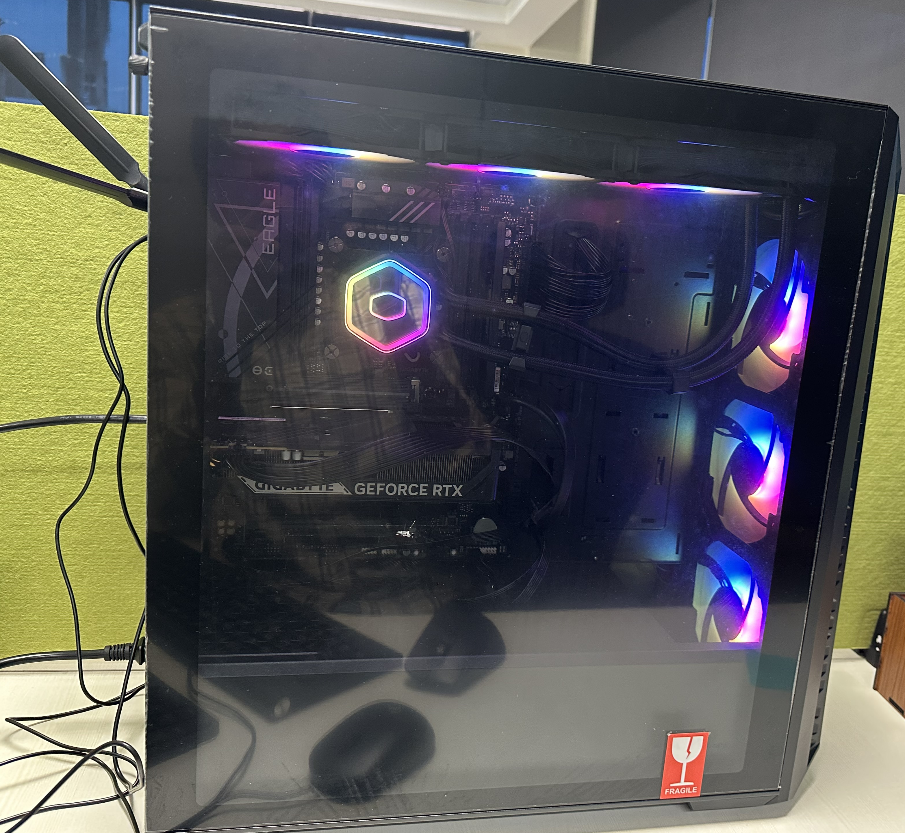

## In-house

### 1. Server

| Specifications  | Details |
| --------------- | ------- |
| GPU model       | 10x Nvidia H100 SXM5    |
| Total memory    | -       |

### 2. Workstation

| Component        | Details                                      |
| ---------------- | -------------------------------------------- |
| Processor        | Intel Core i9-14900K (14th Gen)              |
| CPU Cooler       | Cooler Master 360 Liquid Cooler              |
| Motherboard      | Gigabyte Z790 UD                             |
| RAM              | Corsair 32 GB DDR5                           |
| Power Supply     | Cooler Master 1000W Gold                     |
| Storage          | Corsair 1 TB SSD                             |
| Graphics Card    | Gigabyte RTX 5060 (8 GB)                     |
| Cabinet          | Cooler Master MB 520                         |
| Monitor          | LG 22-inch                                   |
| Peripherals      | HP Keyboard & Mouse                          |
| Operating System | Windows 11 Pro                               |
| Warranty         | Standard manufacturer warranty (all components) |

### 3. Mac Studio

| Specifications  | Details |
| --------------- | ------- |
| GPU model       | -       |
| Total memory    | -       |

---

## Computational allocations